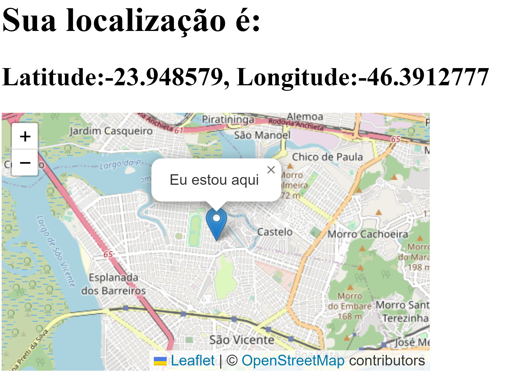

# Rastreador de endereço IP

## Bem-vindo! 👋

Obrigado por verificar este desafio de codificação de front-end.

Melhorarando as habilidades de codificação criando projetos realistas.

**Para fazer este desafio,usei a linguagem básica de HTML, CSS e JavaScript.**

## O Desafio

O desafio que escolhi foi construir este aplicativo Rastreador de Endereço IP.
** **
Para obter os locais do endereço IP, eu usei o [API de geolocalização de IP por IPify](https://geo.ipify.org/). Para gerar o mapa, [LeafletJS](https://leafletjs.com/).

Os usuários devem ser capazes de:

- Ver o layout ideal para cada página.

- Ver os estados de foco para todos os elementos interativos na página
- Ver seu próprio endereço IP no mapa no carregamento da página inicial
- Pesquisar endereços IP ou domínios e ver as principais informações e localizaçôes.
